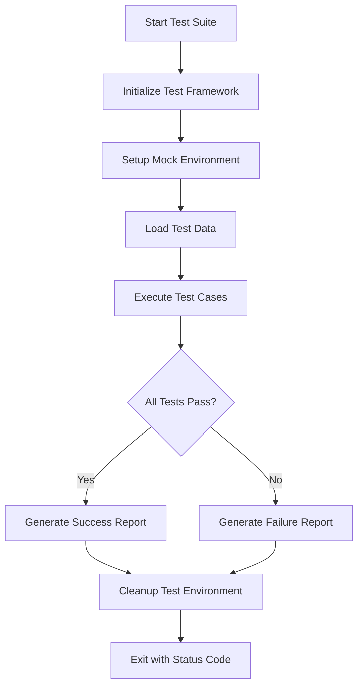

# COBOL Unit Testing Framework - Comprehensive Test Plan

## Executive Summary

This document outlines a comprehensive unit testing strategy for the COBOL banking applications, including ACCTDEMO, ACCTMGMT, CUSTINFO, and INITFILE programs. The framework uses modern testing practices with mock file systems, automated test runners, and CI/CD integration.

## Table of Contents

1. [Testing Approach](#testing-approach)
2. [Test Framework Architecture](#test-framework-architecture)
3. [Test Coverage Strategy](#test-coverage-strategy)
4. [Program-Specific Test Plans](#program-specific-test-plans)
5. [Test Data Management](#test-data-management)
6. [Automation and CI/CD](#automation-and-cicd)
7. [Execution and Reporting](#execution-and-reporting)

---

## 1. Testing Approach

### 1.1 Testing Philosophy

- **Unit Testing**: Test individual paragraphs/sections in isolation
- **Integration Testing**: Test program interactions with files and databases
- **Mock-Based Testing**: Use mock file systems to avoid dependencies
- **Automated Testing**: Enable CI/CD pipeline integration
- **Test-Driven Development**: Write tests before or alongside code changes

### 1.2 Testing Framework Components

```
tests/
├── framework/
│   ├── TESTUTIL.CBL      # Test utilities and mock file system
│   ├── TESTASSERT.CBL    # Assertion library
│   ├── TESTDATA.CBL      # Test data generator
│   └── TESTREPORT.CBL    # Test reporting utilities
├── unit/
│   ├── TEST-INITFILE.CBL
│   ├── TEST-ACCTDEMO.CBL
│   ├── TEST-ACCTMGMT.CBL
│   └── TEST-CUSTINFO.CBL
├── integration/
│   ├── TEST-INTEGRATION.CBL
│   └── TEST-E2E.CBL
├── data/
│   ├── fixtures/         # Test data files
│   └── expected/         # Expected output files
├── scripts/
│   ├── run-all-tests.sh
│   ├── run-unit-tests.sh
│   ├── generate-report.py
│   └── cleanup-test-data.sh
└── reports/
    └── test-results/
```

---

## 2. Test Framework Architecture

### 2.1 Core Components

#### TESTUTIL.CBL - Test Utilities
```cobol
FEATURES:
- Mock file system creation/cleanup
- Test setup and teardown
- File comparison utilities
- Test isolation mechanisms
- Performance measurement
```

#### TESTASSERT.CBL - Assertion Library
```cobol
ASSERTIONS:
- ASSERT-EQUALS (numeric, alphanumeric)
- ASSERT-NOT-EQUALS
- ASSERT-TRUE / ASSERT-FALSE
- ASSERT-NULL / ASSERT-NOT-NULL
- ASSERT-FILE-EXISTS
- ASSERT-FILE-CONTENT-EQUALS
- ASSERT-GREATER-THAN / ASSERT-LESS-THAN
- ASSERT-CONTAINS
```

#### TESTDATA.CBL - Test Data Generator
```cobol
CAPABILITIES:
- Generate valid account records
- Generate valid customer records
- Generate edge case data
- Generate invalid data for negative tests
- Populate mock files with test data
```

### 2.2 Test Execution Flow



---

## 3. Test Coverage Strategy

### 3.1 Coverage Goals

| Program | Target Coverage | Priority |
|---------|----------------|----------|
| INITFILE | 100% | High |
| ACCTDEMO | 95% | High |
| ACCTMGMT | 90% | Critical |
| CUSTINFO | 90% | Critical |

### 3.2 Test Categories

#### Positive Tests (Happy Path)
- Valid input data
- Successful operations
- Expected outcomes

#### Negative Tests (Error Handling)
- Invalid input data
- File errors
- Business rule violations
- Boundary conditions

#### Edge Cases
- Minimum/maximum values
- Empty files
- Large datasets
- Concurrent access scenarios

#### Integration Tests
- File interactions
- Database operations
- Program-to-program calls

---

## 4. Program-Specific Test Plans

### 4.1 INITFILE.CBL Test Plan

**Purpose**: Initialize indexed files for demo

**Test Cases**:

| Test ID | Description | Input | Expected Output | Priority |
|---------|-------------|-------|-----------------|----------|
| INIT-001 | Create account file successfully | None | File created, status 00 | High |
| INIT-002 | Create customer file successfully | None | File created, status 00 | High |
| INIT-003 | Handle existing files | Existing files | Files recreated | Medium |
| INIT-004 | Handle file creation errors | Read-only directory | Error status, message displayed | Medium |
| INIT-005 | Verify file structure | Created files | Correct record layout | High |

**Mock Requirements**:
- Mock file system with configurable permissions
- Simulate file creation success/failure

---

### 4.2 ACCTDEMO.CBL Test Plan

**Purpose**: Account management demo with 5 test accounts

**Test Cases**:

| Test ID | Description | Input | Expected Output | Priority |
|---------|-------------|-------|-----------------|----------|
| DEMO-001 | Initialize files successfully | None | Files initialized | High |
| DEMO-002 | Create 5 demo accounts | Demo data | 5 accounts created | High |
| DEMO-003 | Display all accounts | 5 accounts | All displayed correctly | High |
| DEMO-004 | Calculate totals correctly | 5 accounts | Correct sum and count | High |
| DEMO-005 | Handle file read errors | Corrupted file | Error handled gracefully | Medium |
| DEMO-006 | Verify account balances | Demo accounts | Balances match expected | High |
| DEMO-007 | Verify formatted output | Account data | Proper formatting (Rp) | Low |
| DEMO-008 | Test cleanup process | Test files | Files closed properly | Medium |

**Test Data**:
```
Account 1: 100000000001, SAVINGS, Rp 10,000,000.00
Account 2: 100000000002, CHECKING, Rp 12,500,000.00
Account 3: 100000000003, SAVINGS, Rp 25,000,000.00
Account 4: 100000000004, CHECKING, Rp 8,000,000.00
Account 5: 100000000006, SAVINGS, Rp 19,000,000.00
Total: Rp 74,500,000.00
```

---

### 4.3 ACCTMGMT.CBL Test Plan

**Purpose**: Account management operations (Create, Update, Inquiry, Close)

**Test Cases**:

#### Account Creation Tests
| Test ID | Description | Input | Expected Output | Priority |
|---------|-------------|-------|-----------------|----------|
| ACCT-001 | Create account with valid customer | Valid customer ID | Account created | Critical |
| ACCT-002 | Reject inactive customer | Inactive customer | Error 2002 | High |
| ACCT-003 | Reject customer without KYC | KYC pending | Error 2003 | High |
| ACCT-004 | Generate unique account number | Valid data | Unique number generated | High |
| ACCT-005 | Initialize account with deposit | 1,000,000 IDR | Balance set correctly | High |
| ACCT-006 | Set default interest rate | Savings account | 2.5% rate | Medium |
| ACCT-007 | Handle duplicate account | Existing number | Error handled | Medium |

#### Account Update Tests
| Test ID | Description | Input | Expected Output | Priority |
|---------|-------------|-------|-----------------|----------|
| ACCT-101 | Update existing account | Valid account | Account updated | High |
| ACCT-102 | Reject update on closed account | Closed account | Error 1002 | High |
| ACCT-103 | Update interest rate | New rate | Rate updated | Medium |
| ACCT-104 | Update transaction timestamp | Current time | Timestamp updated | Medium |
| ACCT-105 | Handle non-existent account | Invalid number | Error 1001 | High |

#### Account Inquiry Tests
| Test ID | Description | Input | Expected Output | Priority |
|---------|-------------|-------|-----------------|----------|
| ACCT-201 | Retrieve account details | Valid account | All details displayed | High |
| ACCT-202 | Handle non-existent account | Invalid number | Error 1001 | High |
| ACCT-203 | Display balance correctly | Account with balance | Formatted balance | Medium |
| ACCT-204 | Display account status | Various statuses | Correct status shown | Medium |

#### Account Closure Tests
| Test ID | Description | Input | Expected Output | Priority |
|---------|-------------|-------|-----------------|----------|
| ACCT-301 | Close account with zero balance | Zero balance | Account closed | High |
| ACCT-302 | Reject closure with balance | Non-zero balance | Error 4003 | Critical |
| ACCT-303 | Reject closure with holds | Account with holds | Error 4003 | Critical |
| ACCT-304 | Set closure date | Valid account | Date set correctly | Medium |
| ACCT-305 | Update account status to closed | Valid account | Status = 'C' | High |

**Mock Requirements**:
- Mock customer file with various statuses
- Mock account file with test accounts
- Simulate file read/write operations
- Mock date/time functions

---

### 4.4 CUSTINFO.CBL Test Plan

**Purpose**: Customer information management with database operations

**Test Cases**:

#### Customer Creation Tests
| Test ID | Description | Input | Expected Output | Priority |
|---------|-------------|-------|-----------------|----------|
| CUST-001 | Create new customer | Valid data | Customer created | Critical |
| CUST-002 | Reject duplicate ID number | Existing ID | Error 2004 | Critical |
| CUST-003 | Generate unique customer ID | Valid data | Unique ID generated | High |
| CUST-004 | Validate email format | Valid email | Email accepted | Medium |
| CUST-005 | Validate phone format | Valid phone | Phone accepted | Medium |
| CUST-006 | Set default credit score | New customer | Score = 700 | Medium |
| CUST-007 | Set KYC status to pending | New customer | Status = 'P' | High |
| CUST-008 | Handle database connection error | DB unavailable | Error 5002 | High |

#### Customer Update Tests
| Test ID | Description | Input | Expected Output | Priority |
|---------|-------------|-------|-----------------|----------|
| CUST-101 | Update customer information | Valid data | Customer updated | High |
| CUST-102 | Reject update on blocked customer | Blocked customer | Error 2002 | High |
| CUST-103 | Update email address | New email | Email updated | Medium |
| CUST-104 | Update phone number | New phone | Phone updated | Medium |
| CUST-105 | Update annual income | New income | Income updated | Medium |
| CUST-106 | Update timestamp | Current time | Timestamp updated | Low |

#### Customer Inquiry Tests
| Test ID | Description | Input | Expected Output | Priority |
|---------|-------------|-------|-----------------|----------|
| CUST-201 | Retrieve customer details | Valid ID | All details displayed | High |
| CUST-202 | Handle non-existent customer | Invalid ID | Error 2001 | High |
| CUST-203 | Display credit score | Customer data | Score displayed | Medium |
| CUST-204 | Display KYC status | Customer data | Status displayed | Medium |

#### KYC Update Tests
| Test ID | Description | Input | Expected Output | Priority |
|---------|-------------|-------|-----------------|----------|
| CUST-301 | Update KYC to complete | Valid customer | Status = 'C' | Critical |
| CUST-302 | Set KYC date | Valid customer | Date set to current | High |
| CUST-303 | Update review date | Valid customer | Review date updated | Medium |
| CUST-304 | Handle non-existent customer | Invalid ID | Error 2001 | High |

#### Credit Limit Calculation Tests
| Test ID | Description | Input | Expected Output | Priority |
|---------|-------------|-------|-----------------|----------|
| CUST-401 | Calculate for high credit score | Score >= 750 | 30% of income | High |
| CUST-402 | Calculate for good credit score | Score >= 650 | 20% of income | High |
| CUST-403 | Calculate for fair credit score | Score >= 550 | 10% of income | High |
| CUST-404 | Zero limit for poor credit | Score < 550 | Limit = 0 | High |
| CUST-405 | Handle missing customer | Invalid ID | Error handled | Medium |

**Mock Requirements**:
- Mock PostgreSQL database connection
- Mock SQL operations (SELECT, INSERT, UPDATE)
- Simulate SQLCODE responses
- Mock transaction commit/rollback

---

## 5. Test Data Management

### 5.1 Test Data Categories

#### Valid Test Data
```cobol
* Customer Data
CUSTOMER-ID: 1234567890
NAME: John Michael Doe
ID-NUMBER: 3201011505850001
EMAIL: john.doe@email.com
MOBILE: 081234567890
ANNUAL-INCOME: 150000000.00
CREDIT-SCORE: 700
STATUS: Active (A)
KYC-STATUS: Complete (C)

* Account Data
ACCOUNT-NUMBER: 202406230001
ACCOUNT-TYPE: Savings (SA)
CUSTOMER-ID: 1234567890
BALANCE: 1000000.00
STATUS: Active (A)
INTEREST-RATE: 2.5000
```

#### Edge Case Data
```cobol
* Minimum Values
BALANCE: 0.00
CREDIT-SCORE: 300
ANNUAL-INCOME: 0.00

* Maximum Values
BALANCE: 9999999999999.99
CREDIT-SCORE: 850
ANNUAL-INCOME: 9999999999999.99

* Boundary Values
BALANCE: 0.01, 50000.00 (minimum balance)
CREDIT-SCORE: 549, 550, 649, 650, 749, 750
```

#### Invalid Test Data
```cobol
* Invalid Customer
CUSTOMER-ID: 0000000000 (invalid)
EMAIL: invalid-email (no @)
MOBILE: 123 (too short)
STATUS: X (invalid status)

* Invalid Account
ACCOUNT-NUMBER: 000000000000 (invalid)
BALANCE: -1000.00 (negative)
ACCOUNT-TYPE: XX (invalid type)
```

### 5.2 Test Data Files

```
tests/data/fixtures/
├── VALID-CUSTOMERS.dat
├── VALID-ACCOUNTS.dat
├── EDGE-CASE-CUSTOMERS.dat
├── EDGE-CASE-ACCOUNTS.dat
├── INVALID-CUSTOMERS.dat
└── INVALID-ACCOUNTS.dat

tests/data/expected/
├── EXPECTED-ACCTDEMO-OUTPUT.txt
├── EXPECTED-ACCTMGMT-OUTPUT.txt
└── EXPECTED-CUSTINFO-OUTPUT.txt
```

---

## 6. Automation and CI/CD

### 6.1 Test Automation Scripts

#### run-all-tests.sh
```bash
#!/bin/bash
# Execute all test suites

echo "Starting COBOL Unit Test Suite..."
./run-unit-tests.sh
./run-integration-tests.sh
python3 generate-report.py
./cleanup-test-data.sh
```

#### run-unit-tests.sh
```bash
#!/bin/bash
# Execute unit tests for each program

cobc -x tests/unit/TEST-INITFILE.CBL -o TEST-INITFILE
./TEST-INITFILE

cobc -x tests/unit/TEST-ACCTDEMO.CBL -o TEST-ACCTDEMO
./TEST-ACCTDEMO

cobc -x tests/unit/TEST-ACCTMGMT.CBL -o TEST-ACCTMGMT
./TEST-ACCTMGMT

cobc -x tests/unit/TEST-CUSTINFO.CBL -o TEST-CUSTINFO
./TEST-CUSTINFO
```

### 6.2 CI/CD Pipeline Configuration

#### .gitlab-ci.yml
```yaml
stages:
  - build
  - test
  - report

variables:
  COBOL_COMPILER: "cobc"

build:
  stage: build
  script:
    - cobc -x programs/INITFILE.CBL
    - cobc -x programs/ACCTDEMO.CBL
    - cobc -x programs/ACCTMGMT.CBL
    - cobc -x programs/CUSTINFO.CBL

test:
  stage: test
  script:
    - cd tests
    - ./scripts/run-all-tests.sh
  artifacts:
    reports:
      junit: tests/reports/junit-report.xml
    paths:
      - tests/reports/

report:
  stage: report
  script:
    - python3 tests/scripts/generate-report.py
  artifacts:
    paths:
      - tests/reports/html/
```

#### GitHub Actions Workflow
```yaml
name: COBOL Unit Tests

on: [push, pull_request]

jobs:
  test:
    runs-on: ubuntu-latest
    steps:
      - uses: actions/checkout@v2
      - name: Install GnuCOBOL
        run: |
          sudo apt-get update
          sudo apt-get install -y gnucobol
      - name: Run Tests
        run: |
          cd tests
          ./scripts/run-all-tests.sh
      - name: Upload Test Results
        uses: actions/upload-artifact@v2
        with:
          name: test-results
          path: tests/reports/
```

---

## 7. Execution and Reporting

### 7.1 Test Execution

#### Manual Execution
```bash
# Run all tests
cd tests
./scripts/run-all-tests.sh

# Run specific test suite
./scripts/run-unit-tests.sh

# Run single test
cobc -x unit/TEST-ACCTDEMO.CBL -o TEST-ACCTDEMO
./TEST-ACCTDEMO
```

#### Automated Execution
- Triggered on git push
- Scheduled nightly runs
- Pre-deployment validation

### 7.2 Test Reporting

#### Console Output Format
```
========================================
COBOL UNIT TEST SUITE
========================================
Running: TEST-INITFILE
  ✓ INIT-001: Create account file successfully
  ✓ INIT-002: Create customer file successfully
  ✓ INIT-003: Handle existing files
  ✗ INIT-004: Handle file creation errors
    Expected: Error status
    Actual: Success status
  ✓ INIT-005: Verify file structure

Tests: 5, Passed: 4, Failed: 1, Skipped: 0
Time: 0.234s
========================================
```

#### HTML Report
- Test summary dashboard
- Detailed test results
- Code coverage metrics
- Trend analysis
- Failure analysis

#### JUnit XML Report
```xml
<?xml version="1.0" encoding="UTF-8"?>
<testsuites>
  <testsuite name="TEST-INITFILE" tests="5" failures="1" time="0.234">
    <testcase name="INIT-001" time="0.045"/>
    <testcase name="INIT-002" time="0.043"/>
    <testcase name="INIT-003" time="0.048"/>
    <testcase name="INIT-004" time="0.052">
      <failure message="Expected error status, got success"/>
    </testcase>
    <testcase name="INIT-005" time="0.046"/>
  </testsuite>
</testsuites>
```

---

## 8. Best Practices

### 8.1 Test Design Principles

1. **Independence**: Each test should run independently
2. **Repeatability**: Tests should produce consistent results
3. **Isolation**: Use mocks to isolate units under test
4. **Clarity**: Test names should clearly describe what is tested
5. **Speed**: Tests should execute quickly
6. **Maintainability**: Tests should be easy to update

### 8.2 Naming Conventions

```cobol
* Test Program Names
TEST-<PROGRAM-NAME>.CBL

* Test Case Names
<PROGRAM>-<NUMBER>: <Description>

* Test Paragraphs
TEST-<FUNCTIONALITY>-<SCENARIO>
```

### 8.3 Code Coverage Goals

- **Statement Coverage**: 90%+
- **Branch Coverage**: 85%+
- **Path Coverage**: 80%+
- **Critical Paths**: 100%

---

## 9. Implementation Timeline

| Phase | Duration | Deliverables |
|-------|----------|--------------|
| Phase 1: Framework Setup | 1 week | Test utilities, assertion library, data generator |
| Phase 2: INITFILE Tests | 2 days | Complete test suite for INITFILE |
| Phase 3: ACCTDEMO Tests | 3 days | Complete test suite for ACCTDEMO |
| Phase 4: ACCTMGMT Tests | 1 week | Complete test suite for ACCTMGMT |
| Phase 5: CUSTINFO Tests | 1 week | Complete test suite for CUSTINFO |
| Phase 6: Integration Tests | 3 days | End-to-end test scenarios |
| Phase 7: Automation | 3 days | CI/CD scripts and configuration |
| Phase 8: Documentation | 2 days | User guide and maintenance docs |

**Total Estimated Time**: 4-5 weeks

---

## 10. Success Criteria

- [ ] All programs have unit tests with 90%+ coverage
- [ ] All critical business logic has 100% test coverage
- [ ] Integration tests validate program interactions
- [ ] Tests execute in CI/CD pipeline automatically
- [ ] Test reports are generated and accessible
- [ ] Zero critical bugs in production after deployment
- [ ] Test execution time < 5 minutes for full suite
- [ ] Documentation is complete and accessible

---

## 11. Maintenance and Updates

### 11.1 Test Maintenance

- Review and update tests when code changes
- Add tests for new features
- Remove obsolete tests
- Refactor tests for better maintainability

### 11.2 Continuous Improvement

- Monitor test execution times
- Analyze test failures
- Update test data regularly
- Improve test coverage incrementally

---

## Appendix A: Test Framework API Reference

### TESTUTIL.CBL Functions
```cobol
CALL 'SETUP-TEST-ENV'
CALL 'TEARDOWN-TEST-ENV'
CALL 'CREATE-MOCK-FILE' USING FILE-NAME
CALL 'DELETE-MOCK-FILE' USING FILE-NAME
CALL 'COMPARE-FILES' USING FILE1 FILE2 RESULT
```

### TESTASSERT.CBL Functions
```cobol
CALL 'ASSERT-EQUALS' USING EXPECTED ACTUAL TEST-NAME
CALL 'ASSERT-TRUE' USING CONDITION TEST-NAME
CALL 'ASSERT-FILE-EXISTS' USING FILE-NAME TEST-NAME
```

---

## Appendix B: Glossary

- **Unit Test**: Test of individual program components
- **Integration Test**: Test of program interactions
- **Mock**: Simulated component for testing
- **Fixture**: Predefined test data
- **Assertion**: Verification of expected outcome
- **Test Suite**: Collection of related tests
- **Test Runner**: Tool that executes tests
- **Coverage**: Measure of code tested

---

**Document Version**: 1.0  
**Last Updated**: 2026-06-23  
**Author**: Bob AI Assistant  
**Status**: Ready for Implementation