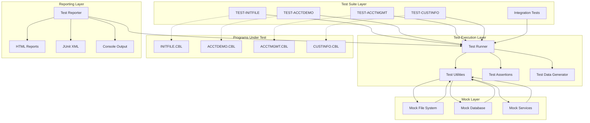
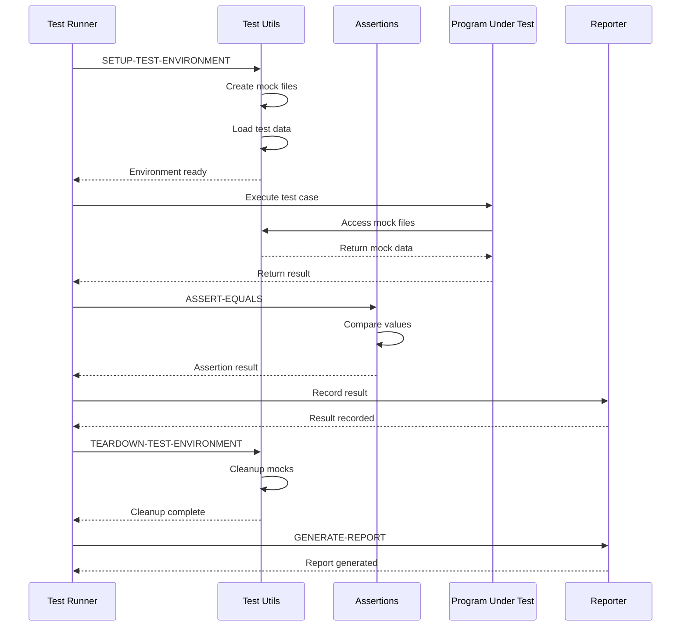

# COBOL Unit Testing Framework - Architecture Design

## Overview

This document describes the technical architecture of the COBOL unit testing framework, including component design, data flow, and implementation details.

## Architecture Diagram



## Component Architecture

### 1. Test Utilities (TESTUTIL.CBL)

**Purpose**: Provide core testing infrastructure and mock capabilities

**Key Features**:
```cobol
IDENTIFICATION DIVISION.
PROGRAM-ID. TESTUTIL.

DATA DIVISION.
WORKING-STORAGE SECTION.
01  TEST-ENVIRONMENT.
    05  TEST-MODE              PIC X(01).
        88  UNIT-TEST-MODE     VALUE 'U'.
        88  INTEGRATION-MODE   VALUE 'I'.
    05  MOCK-ENABLED           PIC X(01).
        88  MOCKS-ACTIVE       VALUE 'Y'.
    05  TEST-DATA-PATH         PIC X(100).
    05  TEMP-FILE-PATH         PIC X(100).
    05  TEST-START-TIME        PIC 9(14).
    05  TEST-END-TIME          PIC 9(14).

01  MOCK-FILE-REGISTRY.
    05  MOCK-FILE-COUNT        PIC 9(03) VALUE ZERO.
    05  MOCK-FILES OCCURS 100 TIMES.
        10  MOCK-FILE-NAME     PIC X(50).
        10  MOCK-FILE-STATUS   PIC X(01).
            88  MOCK-ACTIVE    VALUE 'A'.
            88  MOCK-INACTIVE  VALUE 'I'.
        10  MOCK-FILE-PATH     PIC X(100).

PROCEDURE DIVISION.

* Setup test environment
SETUP-TEST-ENVIRONMENT.
    DISPLAY "Setting up test environment..."
    PERFORM CREATE-TEMP-DIRECTORY
    PERFORM INITIALIZE-MOCK-REGISTRY
    SET UNIT-TEST-MODE TO TRUE
    SET MOCKS-ACTIVE TO TRUE
    ACCEPT TEST-START-TIME FROM TIME
    DISPLAY "Test environment ready".

* Teardown test environment
TEARDOWN-TEST-ENVIRONMENT.
    DISPLAY "Cleaning up test environment..."
    PERFORM CLEANUP-MOCK-FILES
    PERFORM REMOVE-TEMP-DIRECTORY
    ACCEPT TEST-END-TIME FROM TIME
    PERFORM CALCULATE-TEST-DURATION
    DISPLAY "Test environment cleaned".

* Create mock file
CREATE-MOCK-FILE.
    * Implementation for creating mock indexed files
    * Registers file in mock registry
    * Returns mock file handle

* Delete mock file
DELETE-MOCK-FILE.
    * Implementation for removing mock files
    * Updates mock registry

* Compare files
COMPARE-FILES.
    * Byte-by-byte file comparison
    * Returns match status
```

**API Functions**:
- `SETUP-TEST-ENVIRONMENT`: Initialize test environment
- `TEARDOWN-TEST-ENVIRONMENT`: Cleanup after tests
- `CREATE-MOCK-FILE`: Create mock indexed file
- `DELETE-MOCK-FILE`: Remove mock file
- `COMPARE-FILES`: Compare two files
- `LOAD-TEST-DATA`: Load fixture data
- `CAPTURE-OUTPUT`: Capture program output
- `MEASURE-PERFORMANCE`: Track execution time

---

### 2. Test Assertions (TESTASSERT.CBL)

**Purpose**: Provide assertion library for test validation

**Architecture**:
```cobol
IDENTIFICATION DIVISION.
PROGRAM-ID. TESTASSERT.

DATA DIVISION.
WORKING-STORAGE SECTION.
01  ASSERTION-RESULTS.
    05  TOTAL-ASSERTIONS       PIC 9(05) VALUE ZERO.
    05  PASSED-ASSERTIONS      PIC 9(05) VALUE ZERO.
    05  FAILED-ASSERTIONS      PIC 9(05) VALUE ZERO.
    05  CURRENT-TEST-NAME      PIC X(50).
    05  ASSERTION-MESSAGE      PIC X(200).

01  ASSERTION-DETAILS.
    05  EXPECTED-VALUE         PIC X(100).
    05  ACTUAL-VALUE           PIC X(100).
    05  COMPARISON-OPERATOR    PIC X(10).
    05  ASSERTION-PASSED       PIC X(01).
        88  ASSERTION-SUCCESS  VALUE 'Y'.
        88  ASSERTION-FAILURE  VALUE 'N'.

PROCEDURE DIVISION.

* Assert equals (numeric)
ASSERT-EQUALS-NUMERIC.
    ENTRY 'ASSERT-EQUALS-NUM' USING 
        EXPECTED-NUM ACTUAL-NUM TEST-NAME.
    ADD 1 TO TOTAL-ASSERTIONS
    IF EXPECTED-NUM = ACTUAL-NUM
        ADD 1 TO PASSED-ASSERTIONS
        SET ASSERTION-SUCCESS TO TRUE
        DISPLAY "  ✓ " TEST-NAME
    ELSE
        ADD 1 TO FAILED-ASSERTIONS
        SET ASSERTION-FAILURE TO TRUE
        DISPLAY "  ✗ " TEST-NAME
        DISPLAY "    Expected: " EXPECTED-NUM
        DISPLAY "    Actual: " ACTUAL-NUM
    END-IF.

* Assert equals (alphanumeric)
ASSERT-EQUALS-ALPHA.
    ENTRY 'ASSERT-EQUALS-ALPHA' USING 
        EXPECTED-ALPHA ACTUAL-ALPHA TEST-NAME.
    * Similar implementation for strings

* Assert true
ASSERT-TRUE.
    ENTRY 'ASSERT-TRUE' USING CONDITION TEST-NAME.
    * Verify condition is true

* Assert false
ASSERT-FALSE.
    ENTRY 'ASSERT-FALSE' USING CONDITION TEST-NAME.
    * Verify condition is false

* Assert greater than
ASSERT-GREATER-THAN.
    ENTRY 'ASSERT-GT' USING VALUE1 VALUE2 TEST-NAME.
    * Verify VALUE1 > VALUE2

* Assert file exists
ASSERT-FILE-EXISTS.
    ENTRY 'ASSERT-FILE-EXISTS' USING FILE-NAME TEST-NAME.
    * Verify file exists in file system

* Get assertion summary
GET-ASSERTION-SUMMARY.
    ENTRY 'GET-SUMMARY' USING SUMMARY-RECORD.
    * Return test statistics
```

**Assertion Types**:
1. **Equality Assertions**
   - ASSERT-EQUALS-NUM (numeric comparison)
   - ASSERT-EQUALS-ALPHA (string comparison)
   - ASSERT-NOT-EQUALS

2. **Boolean Assertions**
   - ASSERT-TRUE
   - ASSERT-FALSE

3. **Comparison Assertions**
   - ASSERT-GREATER-THAN
   - ASSERT-LESS-THAN
   - ASSERT-GREATER-OR-EQUAL
   - ASSERT-LESS-OR-EQUAL

4. **File Assertions**
   - ASSERT-FILE-EXISTS
   - ASSERT-FILE-NOT-EXISTS
   - ASSERT-FILE-CONTENT-EQUALS

5. **Collection Assertions**
   - ASSERT-CONTAINS
   - ASSERT-NOT-CONTAINS

---

### 3. Test Data Generator (TESTDATA.CBL)

**Purpose**: Generate test data fixtures programmatically

**Architecture**:
```cobol
IDENTIFICATION DIVISION.
PROGRAM-ID. TESTDATA.

DATA DIVISION.
WORKING-STORAGE SECTION.
01  DATA-GENERATION-CONFIG.
    05  RECORD-COUNT           PIC 9(05).
    05  DATA-TYPE              PIC X(10).
    05  INCLUDE-EDGE-CASES     PIC X(01).
        88  INCLUDE-EDGES      VALUE 'Y'.
    05  INCLUDE-INVALID-DATA   PIC X(01).
        88  INCLUDE-INVALID    VALUE 'Y'.

COPY ACCTREC.
COPY CUSTREC.

PROCEDURE DIVISION.

* Generate valid customer records
GENERATE-VALID-CUSTOMERS.
    ENTRY 'GEN-VALID-CUST' USING 
        RECORD-COUNT OUTPUT-FILE.
    PERFORM VARYING WS-COUNTER FROM 1 BY 1
        UNTIL WS-COUNTER > RECORD-COUNT
        PERFORM CREATE-VALID-CUSTOMER
        WRITE CUSTOMER-RECORD
    END-PERFORM.

* Generate valid account records
GENERATE-VALID-ACCOUNTS.
    ENTRY 'GEN-VALID-ACCT' USING 
        RECORD-COUNT OUTPUT-FILE.
    * Similar implementation

* Generate edge case data
GENERATE-EDGE-CASES.
    ENTRY 'GEN-EDGE-CASES' USING OUTPUT-FILE.
    * Generate boundary values
    * Minimum/maximum values
    * Zero values
    * Special characters

* Generate invalid data
GENERATE-INVALID-DATA.
    ENTRY 'GEN-INVALID-DATA' USING OUTPUT-FILE.
    * Generate data that should fail validation
    * Invalid formats
    * Out of range values
    * Missing required fields
```

**Data Generation Strategies**:
1. **Valid Data**: Realistic, valid records
2. **Edge Cases**: Boundary values, extremes
3. **Invalid Data**: Data that should fail validation
4. **Random Data**: Randomized valid data
5. **Sequential Data**: Predictable sequences

---

### 4. Test Reporter (TESTREPORT.CBL)

**Purpose**: Generate test execution reports

**Architecture**:
```cobol
IDENTIFICATION DIVISION.
PROGRAM-ID. TESTREPORT.

DATA DIVISION.
WORKING-STORAGE SECTION.
01  REPORT-CONFIG.
    05  REPORT-FORMAT          PIC X(10).
        88  CONSOLE-FORMAT     VALUE 'CONSOLE'.
        88  HTML-FORMAT        VALUE 'HTML'.
        88  XML-FORMAT         VALUE 'XML'.
    05  REPORT-PATH            PIC X(100).
    05  INCLUDE-DETAILS        PIC X(01).
        88  DETAILED-REPORT    VALUE 'Y'.

01  TEST-RESULTS.
    05  TOTAL-TESTS            PIC 9(05).
    05  PASSED-TESTS           PIC 9(05).
    05  FAILED-TESTS           PIC 9(05).
    05  SKIPPED-TESTS          PIC 9(05).
    05  EXECUTION-TIME         PIC 9(05)V99.

PROCEDURE DIVISION.

* Generate console report
GENERATE-CONSOLE-REPORT.
    DISPLAY "========================================"
    DISPLAY "COBOL UNIT TEST RESULTS"
    DISPLAY "========================================"
    DISPLAY "Total Tests: " TOTAL-TESTS
    DISPLAY "Passed: " PASSED-TESTS
    DISPLAY "Failed: " FAILED-TESTS
    DISPLAY "Skipped: " SKIPPED-TESTS
    DISPLAY "Execution Time: " EXECUTION-TIME " seconds"
    DISPLAY "========================================"
    IF FAILED-TESTS > 0
        PERFORM DISPLAY-FAILURES
    END-IF.

* Generate HTML report
GENERATE-HTML-REPORT.
    * Create HTML file with test results
    * Include charts and graphs
    * Detailed test case information

* Generate JUnit XML report
GENERATE-JUNIT-XML.
    * Create JUnit-compatible XML
    * For CI/CD integration
```

---

## Data Flow Architecture

### Test Execution Flow



---

## File System Architecture

### Directory Structure

```
Module - COBOL Application/
├── programs/                    # Source programs
│   ├── INITFILE.CBL
│   ├── ACCTDEMO.CBL
│   ├── ACCTMGMT.CBL
│   └── CUSTINFO.CBL
├── copybooks/                   # Shared copybooks
│   ├── ACCTREC.CPY
│   ├── CUSTREC.CPY
│   └── ERRCODE.CPY
├── tests/                       # Test directory
│   ├── framework/               # Test framework
│   │   ├── TESTUTIL.CBL        # Test utilities
│   │   ├── TESTASSERT.CBL      # Assertions
│   │   ├── TESTDATA.CBL        # Data generator
│   │   └── TESTREPORT.CBL      # Reporter
│   ├── unit/                    # Unit tests
│   │   ├── TEST-INITFILE.CBL
│   │   ├── TEST-ACCTDEMO.CBL
│   │   ├── TEST-ACCTMGMT.CBL
│   │   └── TEST-CUSTINFO.CBL
│   ├── integration/             # Integration tests
│   │   ├── TEST-INTEGRATION.CBL
│   │   └── TEST-E2E.CBL
│   ├── data/                    # Test data
│   │   ├── fixtures/            # Input fixtures
│   │   │   ├── VALID-CUSTOMERS.dat
│   │   │   ├── VALID-ACCOUNTS.dat
│   │   │   ├── EDGE-CASES.dat
│   │   │   └── INVALID-DATA.dat
│   │   └── expected/            # Expected outputs
│   │       ├── EXPECTED-ACCTDEMO.txt
│   │       └── EXPECTED-ACCTMGMT.txt
│   ├── scripts/                 # Automation scripts
│   │   ├── run-all-tests.sh
│   │   ├── run-unit-tests.sh
│   │   ├── generate-report.py
│   │   └── cleanup-test-data.sh
│   ├── reports/                 # Test reports
│   │   ├── html/
│   │   ├── xml/
│   │   └── console/
│   └── temp/                    # Temporary files
│       └── mock-files/
└── docs/                        # Documentation
    ├── COBOL-UNIT-TEST-PLAN.md
    └── TEST-FRAMEWORK-ARCHITECTURE.md
```

---

## Mock System Architecture

### Mock File System

**Purpose**: Simulate file operations without actual file I/O

**Implementation Strategy**:
```cobol
01  MOCK-FILE-SYSTEM.
    05  MOCK-MODE-ACTIVE       PIC X(01).
        88  MOCKS-ENABLED      VALUE 'Y'.
    05  MOCK-FILE-TABLE.
        10  MOCK-FILE OCCURS 50 TIMES.
            15  MOCK-FILE-ID   PIC X(20).
            15  MOCK-STATUS    PIC XX.
            15  MOCK-RECORDS.
                20  MOCK-REC OCCURS 1000 TIMES.
                    25  MOCK-DATA PIC X(500).
            15  MOCK-REC-COUNT PIC 9(04).
            15  MOCK-CURRENT-REC PIC 9(04).

* Intercept file operations
MOCK-OPEN-FILE.
    IF MOCKS-ENABLED
        PERFORM REGISTER-MOCK-FILE
        MOVE '00' TO FILE-STATUS
    ELSE
        PERFORM ACTUAL-OPEN-FILE
    END-IF.

MOCK-READ-FILE.
    IF MOCKS-ENABLED
        PERFORM READ-FROM-MOCK-TABLE
    ELSE
        PERFORM ACTUAL-READ-FILE
    END-IF.

MOCK-WRITE-FILE.
    IF MOCKS-ENABLED
        PERFORM WRITE-TO-MOCK-TABLE
    ELSE
        PERFORM ACTUAL-WRITE-FILE
    END-IF.
```

### Mock Database

**Purpose**: Simulate database operations for CUSTINFO tests

**Implementation Strategy**:
```cobol
01  MOCK-DATABASE.
    05  MOCK-DB-ACTIVE         PIC X(01).
        88  DB-MOCK-ENABLED    VALUE 'Y'.
    05  MOCK-SQLCODE           PIC S9(09) COMP.
    05  MOCK-CUSTOMER-TABLE.
        10  MOCK-CUST OCCURS 100 TIMES.
            15  MOCK-CUST-ID   PIC 9(10).
            15  MOCK-CUST-DATA PIC X(700).
    05  MOCK-CUST-COUNT        PIC 9(03).

* Intercept SQL operations
MOCK-SQL-CONNECT.
    IF DB-MOCK-ENABLED
        MOVE 0 TO MOCK-SQLCODE
    ELSE
        PERFORM ACTUAL-SQL-CONNECT
    END-IF.

MOCK-SQL-SELECT.
    IF DB-MOCK-ENABLED
        PERFORM SEARCH-MOCK-TABLE
        IF RECORD-FOUND
            MOVE 0 TO MOCK-SQLCODE
        ELSE
            MOVE 100 TO MOCK-SQLCODE
        END-IF
    ELSE
        PERFORM ACTUAL-SQL-SELECT
    END-IF.
```

---

## Performance Considerations

### Optimization Strategies

1. **Lazy Loading**: Load test data only when needed
2. **Caching**: Cache frequently used test data
3. **Parallel Execution**: Run independent tests in parallel
4. **Resource Pooling**: Reuse mock resources
5. **Incremental Testing**: Run only changed tests

### Performance Metrics

```cobol
01  PERFORMANCE-METRICS.
    05  TEST-START-TIME        PIC 9(14).
    05  TEST-END-TIME          PIC 9(14).
    05  SETUP-TIME             PIC 9(05)V99.
    05  EXECUTION-TIME         PIC 9(05)V99.
    05  TEARDOWN-TIME          PIC 9(05)V99.
    05  TOTAL-TIME             PIC 9(05)V99.
```

**Target Performance**:
- Setup time: < 0.5 seconds
- Individual test: < 0.1 seconds
- Full suite: < 5 minutes
- Teardown time: < 0.5 seconds

---

## Error Handling Architecture

### Error Categories

1. **Test Framework Errors**: Issues with test infrastructure
2. **Assertion Failures**: Expected vs actual mismatches
3. **Program Errors**: Bugs in programs under test
4. **Environment Errors**: File system, database issues

### Error Handling Strategy

```cobol
01  ERROR-HANDLING.
    05  ERROR-OCCURRED         PIC X(01).
        88  ERROR-DETECTED     VALUE 'Y'.
    05  ERROR-CODE             PIC X(04).
    05  ERROR-MESSAGE          PIC X(200).
    05  ERROR-LOCATION         PIC X(50).
    05  ERROR-SEVERITY         PIC X(01).
        88  FATAL-ERROR        VALUE 'F'.
        88  WARNING-ERROR      VALUE 'W'.
        88  INFO-ERROR         VALUE 'I'.

HANDLE-TEST-ERROR.
    IF FATAL-ERROR
        PERFORM ABORT-TEST-SUITE
    ELSE IF WARNING-ERROR
        PERFORM LOG-WARNING
        PERFORM CONTINUE-TESTING
    ELSE
        PERFORM LOG-INFO
    END-IF.
```

---

## Security Considerations

### Test Data Security

1. **No Production Data**: Never use real customer data
2. **Anonymization**: Anonymize any sensitive test data
3. **Encryption**: Encrypt sensitive test fixtures
4. **Access Control**: Restrict test data access

### Test Environment Isolation

1. **Separate Databases**: Use test-only databases
2. **Isolated File Systems**: Use temporary directories
3. **Network Isolation**: No external connections
4. **Resource Limits**: Prevent resource exhaustion

---

## Extensibility

### Adding New Test Types

```cobol
* Template for new test program
IDENTIFICATION DIVISION.
PROGRAM-ID. TEST-NEWPROGRAM.

ENVIRONMENT DIVISION.
CONFIGURATION SECTION.
REPOSITORY.
    FUNCTION ALL INTRINSIC.

DATA DIVISION.
WORKING-STORAGE SECTION.
COPY TESTUTIL.
COPY TESTASSERT.

01  TEST-SUITE-NAME            PIC X(50) VALUE 'TEST-NEWPROGRAM'.

PROCEDURE DIVISION.
MAIN-TEST-LOGIC.
    CALL 'SETUP-TEST-ENVIRONMENT'
    PERFORM RUN-ALL-TESTS
    CALL 'TEARDOWN-TEST-ENVIRONMENT'
    CALL 'GENERATE-REPORT'
    STOP RUN.

RUN-ALL-TESTS.
    PERFORM TEST-CASE-001
    PERFORM TEST-CASE-002
    * Add more test cases

TEST-CASE-001.
    * Test implementation
    CALL 'ASSERT-EQUALS' USING EXPECTED ACTUAL 'Test Name'.
```

### Adding New Assertions

```cobol
* Add to TESTASSERT.CBL
ASSERT-NEW-CONDITION.
    ENTRY 'ASSERT-NEW' USING PARAM1 PARAM2 TEST-NAME.
    * Implementation
    * Update assertion counters
    * Display results
```

---

## Integration Points

### CI/CD Integration

**Jenkins**:
```groovy
pipeline {
    stages {
        stage('Test') {
            steps {
                sh 'cd tests && ./scripts/run-all-tests.sh'
            }
        }
    }
    post {
        always {
            junit 'tests/reports/xml/*.xml'
        }
    }
}
```

**GitLab CI**:
```yaml
test:
  script:
    - cd tests
    - ./scripts/run-all-tests.sh
  artifacts:
    reports:
      junit: tests/reports/xml/*.xml
```

---

## Maintenance Guidelines

### Regular Maintenance Tasks

1. **Update Test Data**: Refresh fixtures quarterly
2. **Review Coverage**: Monthly coverage analysis
3. **Refactor Tests**: Improve test quality
4. **Update Documentation**: Keep docs current
5. **Performance Tuning**: Optimize slow tests

### Version Control

- Tag test framework versions
- Track test data versions
- Document breaking changes
- Maintain changelog

---

## Conclusion

This architecture provides a robust, maintainable, and extensible testing framework for COBOL applications. The modular design allows for easy updates and additions while maintaining consistency across all test suites.

**Key Benefits**:
- ✓ Comprehensive test coverage
- ✓ Automated execution
- ✓ CI/CD integration
- ✓ Detailed reporting
- ✓ Easy maintenance
- ✓ Scalable design

---

**Document Version**: 1.0  
**Last Updated**: 2026-06-23  
**Author**: Bob AI Assistant  
**Status**: Ready for Implementation