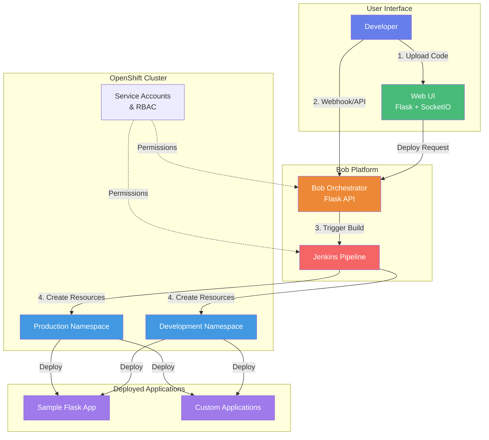
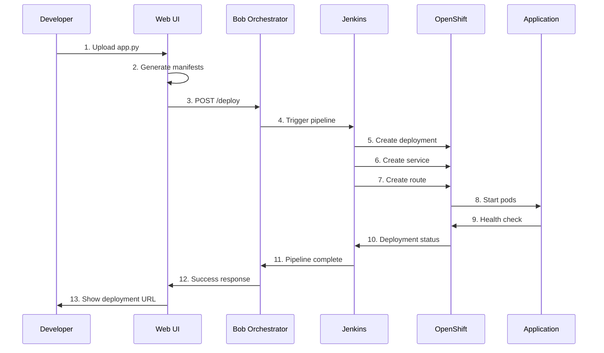

# Bob Deployment Platform - Workshop Guide

## Architecture Overview



## Project Structure

```
Module-5-Deployment-Platform/
├── 📄 README.md                          # This file - Workshop guide
├── 📄 credentials.yaml.example           # Template for cluster credentials
├── 🔧 install-oc-cli.sh                  # macOS OpenShift CLI installer
├── 🔧 install-oc-cli-linux.sh            # Linux OpenShift CLI installer
│
├── 📂 bob/                               # Bob Orchestrator - Core deployment engine
│   ├── orchestrator.py                   # Main Flask API for deployments
│   ├── jenkins.py                        # Jenkins pipeline integration
│   └── k8s/                              # Bob's Kubernetes manifests
│       ├── deployment.yaml               # Bob orchestrator deployment
│       ├── service.yaml                  # Bob service definition
│       └── route.yaml                    # Bob external route
│
├── 📂 web-ui/                            # Web UI - Visual deployment interface
│   ├── app.py                            # Flask backend with SocketIO
│   ├── k8s/                              # Web UI Kubernetes manifests
│   │   ├── deployment-simple.yaml        # Web UI deployment
│   │   ├── service.yaml                  # Web UI service
│   │   └── route.yaml                    # Web UI external route
│   ├── static/                           # Frontend assets
│   │   ├── css/
│   │   │   └── style.css                 # UI styling
│   │   └── js/
│   │       ├── app.js                    # Main JavaScript
│   │       └── deploy.js                 # Deployment logic
│   └── templates/                        # HTML templates
│       ├── index.html                    # Main deployment page
│       └── status.html                   # Deployment status page
│
├── 📂 k8s/                               # Infrastructure Kubernetes manifests
│   ├── 00-namespaces.yaml                # Production & Development namespaces
│   ├── 01-serviceaccount-rbac.yaml       # Service accounts & permissions
│   └── 02-secret.yaml.example            # Secret template for tokens
│
├── 📂 sample-app/                        # Sample Flask application
│   ├── app.py                            # Simple Flask web app
│   ├── Dockerfile                        # Container image definition
│   ├── requirements.txt                  # Python dependencies
│   └── README.md                         # Sample app documentation
│
└── 📂 docs/                              # Workshop documentation
    ├── QUICKSTART.md                     # Quick start guide
    ├── cheatsheet.md                     # Command reference
    └──  troubleshooting.md                # Common issues & solutions
```

## Deployment Flow



## Documentation

All detailed documentation has been organized in the `docs/` folder:

- **[QUICKSTART.md](docs/QUICKSTART.md)** - Get started in 15 minutes
- **[cheatsheet.md](docs/cheatsheet.md)** - Command reference and shortcuts
- **[troubleshooting.md](docs/troubleshooting.md)** - Common issues and solutions

## Workshop Overview

This workshop teaches you how to deploy Python applications to OpenShift using the Bob Deployment Platform - an automated deployment orchestrator that simplifies the entire deployment process.

**What You'll Learn:**
- Deploy Python applications to OpenShift
- Use Bob Orchestrator for automated deployments
- Configure Jenkins pipelines
- Manage Kubernetes resources
- Use the Web UI for visual deployments

**Prerequisites:**
- Basic Python knowledge
- Basic understanding of containers
- OpenShift cluster access (provided by instructor)
- Terminal/command line familiarity

## Workshop Structure

### Part 1: Setup
- Install OpenShift CLI
- Connect to cluster
- Verify access

### Part 2: Infrastructure
- Create namespaces
- Configure service accounts
- Set up RBAC permissions
- Deploy Jenkins

### Part 3: Bob Orchestrator
- Deploy Bob Orchestrator
- Configure secrets
- Test webhook endpoints
- Trigger deployments

### Part 4: Web UI
- Deploy Web UI
- Use visual interface
- Monitor deployments
- Troubleshoot issues

### Part 5: Hands-on Practice
- Deploy sample applications
- Customize configurations
- Debug common issues

## Quick Start

### Step 1: Install OpenShift CLI

**macOS:**
```bash
cd Module-5-Deployment-Platform/
chmod +x install-oc-cli.sh
./install-oc-cli.sh
```

**Linux:**
```bash
cd Module-5-Deployment-Platform/
chmod +x install-oc-cli-linux.sh
./install-oc-cli-linux.sh
```

**Windows:**
Download from: https://mirror.openshift.com/pub/openshift-v4/clients/ocp/stable/

### Step 2: Configure Credentials

1. Get cluster credentials from instructor
2. Copy `credentials.yaml.example` to `credentials.yaml`
3. Fill in your cluster details:

```yaml
cluster:
  api_url: "https://api.your-cluster.example.com:6443"
  console_url: "https://console.your-cluster.example.com"
  username: "your-username"
  password: "your-password"
```

### Step 3: Login to Cluster

```bash
# Login using credentials
oc login <API_URL> -u <USERNAME> -p <PASSWORD>

# Verify connection
oc whoami
oc cluster-info
```

### Step 4: Deploy Infrastructure

```bash
# Create namespaces
oc apply -f k8s/00-namespaces.yaml

# Create service accounts and RBAC
oc apply -f k8s/01-serviceaccount-rbac.yaml

# Verify
oc get namespaces | grep -E "production|development"
oc get sa jenkins-sa -n production
```

### Step 5: Configure Secrets

```bash
# Get your OpenShift token
oc whoami -t

# Copy secret template
cp k8s/02-secret.yaml.example k8s/02-secret.yaml

# Edit and add your token
nano k8s/02-secret.yaml

# Apply secrets
oc apply -f k8s/02-secret.yaml
```

### Step 6: Deploy Bob Orchestrator

```bash
# Create ConfigMaps
oc create configmap bob-orchestrator-code \
  --from-file=orchestrator.py=bob/orchestrator.py \
  --from-file=jenkins.py=bob/jenkins.py \
  -n production

# Deploy Bob
oc apply -f bob/k8s/

# Verify
oc get pods -n production | grep bob
```

### Step 7: Deploy Web UI

```bash
# Create ConfigMaps
oc create configmap bob-web-ui-code \
  --from-file=app.py=web-ui/app.py \
  -n production

oc create configmap bob-web-ui-templates \
  --from-file=web-ui/templates/ \
  -n production

oc create configmap bob-web-ui-css \
  --from-file=style.css=web-ui/static/css/style.css \
  -n production

oc create configmap bob-web-ui-js \
  --from-file=app.js=web-ui/static/js/app.js \
  --from-file=deploy.js=web-ui/static/js/deploy.js \
  -n production

# Deploy Web UI
oc apply -f web-ui/k8s/

# Get Web UI URL
oc get route bob-web-ui -n production
```

## Workshop Exercises

### Exercise 1: Deploy Sample Application

Deploy the provided sample Flask application:

```bash
cd sample-app/

# Review the application
cat app.py

# Deploy using Bob webhook
curl -X POST <BOB_WEBHOOK_URL> \
  -H "Content-Type: application/json" \
  -d '{"text":"/deploy production"}'
```

### Exercise 2: Use Web UI

1. Open Web UI in browser
2. Fill in application details
3. Upload `sample-app/app.py`
4. Click "Deploy Application"
5. Monitor deployment progress

## Useful Commands

### Check Deployment Status
```bash
# List all pods
oc get pods -n production

# Check pod logs
oc logs <pod-name> -n production

# Describe pod
oc describe pod <pod-name> -n production

# Check deployments
oc get deployments -n production

# Check routes
oc get routes -n production
```

### Debug Issues
```bash
# Execute command in pod
oc exec -it <pod-name> -n production -- /bin/bash

# Port forward for local testing
oc port-forward <pod-name> 8080:8080 -n production

# View events
oc get events -n production --sort-by='.lastTimestamp'

# Check resource usage
oc top pods -n production
```

### Cleanup
```bash
# Delete specific deployment
oc delete deployment <name> -n production

# Delete all resources in namespace
oc delete all --all -n production

# Delete namespace
oc delete namespace production
```

## Additional Resources

### Documentation
- [OpenShift Documentation](https://docs.openshift.com/)
- [Kubernetes Documentation](https://kubernetes.io/docs/)
- [Flask Documentation](https://flask.palletsprojects.com/)

### Cheat Sheets
- See `docs/cheatsheet.md` for quick reference
- See `docs/troubleshooting.md` for common issues

### Sample Applications
- `sample-app/` - Basic Flask application
- `sample-app-advanced/` - Advanced Flask with database
